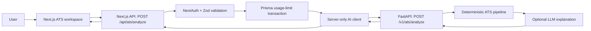
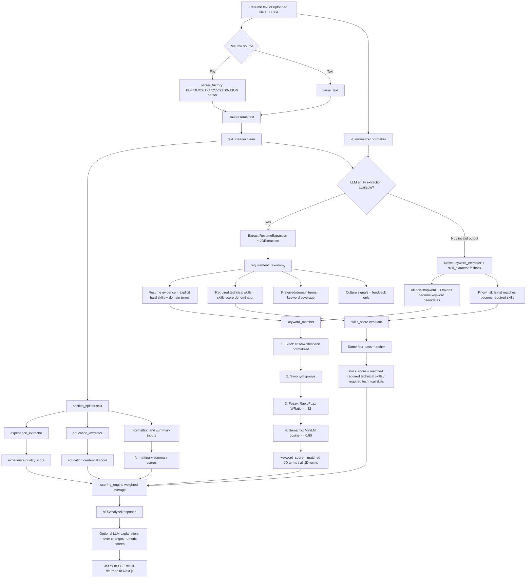

# JobPatra ATS: Architecture, Score Flow, and Audit

**Reviewed:** 2026-08-29  
**Scope:** `resume-saas/` (Next.js application) and `Ai_backend/` (FastAPI ATS service).

## What JobPatra is

JobPatra is a two-service resume platform:

| Service | Owns | Does not own |
| --- | --- | --- |
| `resume-saas` | UI, NextAuth, PostgreSQL/Prisma, resume data, subscription usage, PDF rendering | ATS calculations and LLM prompts |
| `Ai_backend` | document parsing, normalization, entity extraction, matching, deterministic scoring, optional AI explanation | users, sessions, database writes, billing |

The Next.js application calls the Python service through a private HTTP API. The browser never calls Python directly.



## User journey and data lifecycle

### Resume input

1. A user chooses an existing JobPatra resume or uploads PDF, DOCX, or TXT in `ats-workspace`.
2. An existing JobPatra resume is converted to plain text by `resumeDetailToText()` in `ats-analyzer-client.tsx`. It includes personal information, summary, experience, education, skills, certifications, projects, and languages.
3. An uploaded file is Base64 encoded in the browser and retained until analysis. The Python service receives the original file bytes and parses the document itself.
4. The user pastes a JD or requests URL extraction. URL extraction uses Python tier 1 (`httpx` + `trafilatura`) and then tier 2 (Playwright + `trafilatura`).
5. The processing page first tries SSE streaming. If the stream fails before receiving a final event, it retries through the regular JSON endpoint.
6. The result and history are stored in browser `localStorage`, not in the `ATSAnalysis` Prisma table. Consequently, analysis history is browser/device specific and disappears if local storage is cleared.

### Request boundary

`POST /api/ats/analyze`:

1. Requires a NextAuth session.
2. Validates `resumeText`, `resumeFileName`, `resumeFileBytes`, JD text, and optional `stream` with Zod.
3. Increments `ATS_ANALYSIS` usage in a Prisma transaction.
4. Calls `/v1/ats/analyze` with `X-Internal-API-Key`, `X-Request-ID`, and the payload.
5. Refunds usage only when the normal JSON request throws after the increment. An error emitted *inside an already-open SSE response* does not pass through this refund path.

## Complete ATS score flowchart



## Exact calculations

All values are clamped to 0–100. The active weights are in `app/analysis/scoring/weights_config.py`.

| Component | Weight | Calculation implemented |
| --- | ---: | --- |
| Keyword coverage | 30% | `matched JD keyword count / total JD keyword count * 100` |
| Experience quality | 25% | 40 points for cumulative duration (full at 8 years), 20 for number of roles (full at 3), 20 for bullet density (full at 4/role), 20 for quantified metrics (full at 6) |
| Required technical skills | 25% | `matched required technical skills / required technical skills * 100` |
| Formatting | 10% | Presence of seven recognized headings: summary 15, experience 30, education 20, skills 20, projects/certifications/languages 5 each |
| Education credential | 5% | Degree-level score (Bachelor 80, Master 90, PhD 100) plus certification bonus up to 10 |
| Summary quality | 5% | Presence, word count, an action word, and a numeric metric |

```text
overall_score =
  0.30 * keyword_score
+ 0.25 * experience_score
+ 0.25 * skills_score
+ 0.10 * formatting_score
+ 0.05 * education_score
+ 0.05 * summary_score
```

The optional LLM explanation sees the completed response and provides strengths, weaknesses, and recommendations. It does not calculate or alter the numeric score.

## Entity extraction and matching

### Preferred path: hybrid extraction

`extract_entities_chain.py` asks an LLM to return strict JSON for a `ResumeExtraction` and a `JDExtraction`. `requirement_taxonomy.py` then applies deterministic policy:

- Resume technical evidence: explicit `hard_skills` plus explicit `domain_terms`.
- Required skill denominator: only `required_hard_skills` from the JD.
- Keyword denominator: required skills, preferred skills, and technical domain terms.
- Culture signals such as “first principles thinking” and “passion for reliability”: returned for feedback but excluded from scores.

This is an important correction: a candidate should not lose technical-skill points because the JD says they should be enthusiastic or use first-principles thinking.

### Fallback path

If either LLM extraction call fails, the whole entity extraction stage falls back:

- `keyword_extractor` tokenizes all text and removes only its stopword list.
- `skill_extractor` recognizes aliases in `reference_data/skills_list.py`.

The fallback remains deterministic and keeps the endpoint alive, but it is substantially less precise. A prose-heavy JD produces many generic keyword candidates, which enlarges the keyword denominator and reduces keyword coverage.

### Match stages

The matcher consumes lists, not entire sentences. Each matched JD term can be consumed only once.

1. Exact case-insensitive match.
2. Synonym-group match from `synonym_map.py`.
3. Fuzzy match using RapidFuzz `WRatio >= 82`.
4. Semantic match using `all-MiniLM-L6-v2` and cosine similarity `>= 0.60`.

For every semantic candidate, the backend logs the top three closest unmatched JD terms as `[SemanticMatcher] Top matches for '…': […]`.

## Audit findings: why a score can look unexpectedly low

### P0 — Entity extraction availability can change the score materially

**Evidence:** `_extract_entities_hybrid()` catches any LLM extraction failure and switches to naive extractors for both resume and JD. LiteLLM has external provider routing, retry, and network dependencies.

**Effect:** The same resume/JD can receive a materially different keyword denominator and therefore a different score when the extraction LLM is unavailable, rate-limited, malformed, or returns invalid JSON. The final arithmetic is deterministic, but the inputs are not guaranteed to be stable.

**Why this explains the reported low result:** In the captured run, the backend logs already showed zero semantic matches and only a small number of keyword matches. If extraction fell back to token-based candidates, generic JD language is counted as missing rather than being classified as a non-score-bearing responsibility/culture statement.

### P0 — The overall score is not a true requirement-fit score for experience and education

**Evidence:** `JDExtraction.min_experience` is extracted but never passed into `experience_score.calculate()`. `experience_score` always rewards total years, number of entries, bullets, and metrics. `education_score` uses only the candidate’s degree/certifications; no JD education requirement exists in the schema.

**Effect:** A candidate can score highly for experience/education quality while failing a JD’s actual seniority or degree requirement. Conversely, a junior candidate with a well-structured resume is penalized or rewarded based on generic content quality rather than role fit.

**Interpretation:** Label the current number as a **JobPatra compatibility and resume-quality score**, not a prediction of a recruiter or ATS decision.

### P0 — Semantic matching must not be used to claim unsupported qualifications

**Evidence:** Semantic matching compares very short labels, one keyword at a time. MiniLM similarities for adjacent engineering concepts are not proof of equivalence.

**Effect:** Lowering the threshold can increase matches, but it can also create false positives. For example, Python does not prove functional-programming experience; cloud computing does not prove edge-computing experience. This should not be used to force the overall score above an expected number.

**Current safeguard:** The synonym map does not map Python directly to functional programming. The taxonomy also excludes culture language from skill coverage.

### P1 — The fallback keyword denominator is too broad

**Evidence:** `keyword_extractor.extract()` returns most non-stopword tokens from the full JD. Its output becomes `jd_keywords` during fallback.

**Effect:** Words such as company/domain/product language may be counted alongside real technical requirements. This depresses `keyword_score` and makes the “missing keywords” list noisy.

**Observed behavior:** A concise structured LLM output should yield about 10–25 terms; fallback can yield many more arbitrary tokens. This is the most direct implementation-level reason a keyword score can drop sharply when LLM extraction is unavailable.

### P1 — A duplicate embedding model is loaded for the skills score

**Evidence:** `ats_service.py` creates `_EMBEDDING_PROVIDER` at module import for keyword matching. `skills_score.py` independently lazy-creates another `SentenceTransformerEmbeddingProvider` for skill matching.

**Effect:** Two copies of the same model may occupy memory and cause inconsistent availability/performance. The second initialization can also add latency during the first score request. Both should share one injected provider.

### P1 — Response contract drift exists between Python and TypeScript

**Evidence:** Python returns `required_skill_count` and `culture_signals`; `resume-saas/src/app/service/ai/types.ts` does not define them.

**Effect:** The browser currently ignores the fields, so users cannot see the denominator or understand that culture requirements were deliberately excluded. Contract drift will become a bug when a UI component relies on these values.

### P1 — History persistence is incomplete

**Evidence:** Prisma defines `ATSAnalysis`, but the current ATS workflow only writes browser `localStorage` entries (`jobpatra_ats_result_*`, `jobpatra_ats_analyses`). No route writes `ATSAnalysis`.

**Effect:** Analysis IDs are not durable, results cannot be viewed across devices, and the database model is stale relative to the actual product behavior.

### P2 — Formatting score measures headings, not general ATS parseability

**Evidence:** `formatting_score.py` awards fixed points only for detected sections. `section_splitter.py` uses line-heading heuristics. The PDF parser extracts text but does not assess tables, columns, text boxes, reading order, fonts, or accessibility.

**Effect:** UI wording that claims layout/parser compatibility is stronger than what the algorithm measures. A visually complex resume can receive a high formatting score if headings are recoverable; a clean resume with nonstandard headings can be penalized.

### P2 — Streaming failures may consume usage without a refund

**Evidence:** Next.js increments usage before creating an SSE response. Later Python failures arrive as SSE `error` events, after the Next route has returned; the route’s `catch` cannot refund.

**Effect:** A user can be charged for an unsuccessful stream (and possibly for a client fallback retry, depending on timing). This is a billing/UX issue, not a numeric-score issue.

### P2 — The public `/ats-checker` page is a static marketing demo

**Evidence:** `AtsPageClient` animates a hard-coded score from 0 to 88 and displays hard-coded findings. It does not submit a resume or call the backend.

**Effect:** It must not be presented as an actual analysis result. The authenticated `/app/ats-workspace` is the real analyzer.

## What is already working correctly

- Internal-service authentication and request IDs separate public browser traffic from the AI backend.
- The deterministic scoring engine has a single active weight configuration whose weights sum to 1.0.
- Matching has a clear stage order and does not let one JD term match multiple resume terms.
- Synonym alias collisions are preserved across multiple canonical groups rather than silently overwritten.
- The service degrades gracefully when the optional explanation LLM fails: numeric reporting still returns.
- The Juspay regression test verifies that culture signals do not contaminate technical-skill coverage and expects 3 of 5 technical requirements, i.e. 60% skills coverage for its fixture.

## How to inspect one production analysis

1. Set `DEBUG_ATS_PIPELINE=true` in the Python configuration.
2. Submit the resume and JD through `/app/ats-workspace`.
3. Find the request ID shared by Next.js and FastAPI logs.
4. Check the log in this order:
   - parser character and word counts;
   - detected sections;
   - whether Hybrid AI extraction succeeded or the fallback message appeared;
   - extracted resume/JD keyword counts;
   - the exact number of required technical skills;
   - exact/synonym/fuzzy/semantic match counts;
   - top-three semantic diagnostics;
   - each subscore and weighted arithmetic.
5. For reproducible forensic evidence, set `SAVE_ATS_ARTIFACTS=true`. The backend writes raw/clean text, extracted entity lists, match results, and the final response to `ats_debug_artifacts/run_<timestamp>/`.

## Recommended acceptance criteria for a reliable score

A result should be considered trustworthy only when all of the following are true:

- The log confirms Hybrid AI entity extraction succeeded, or the result is explicitly labeled as fallback/low-confidence.
- The UI exposes the required technical-skill denominator and culture signals.
- Missing terms are reviewed for semantic validity; never add a match only to reach a target percentage.
- The score is interpreted together with component scores, particularly `skills_score` and `keyword_score`.
- Any future experience/education score uses the JD’s stated requirements, not only resume quality signals.

## Relevant source map

| Area | Primary source files |
| --- | --- |
| ATS UI and browser persistence | `resume-saas/src/app/app/(dashboard)/ats-workspace/**` |
| Next.js ATS API proxy | `resume-saas/src/app/api/(controller)/ats/analyze/route.ts` |
| Internal service client | `resume-saas/src/app/service/ai/client.ts`, `ats.service.ts`, `types.ts` |
| FastAPI entry and ATS route | `Ai_backend/main.py`, `app/api/v1/ats.py` |
| Pipeline orchestration | `Ai_backend/app/services/ats_service.py` |
| Parsing and normalization | `app/analysis/parsers/**`, `app/analysis/normalization/**` |
| Hybrid LLM extraction | `app/ai/chains/extract_entities_chain.py`, `app/ai/prompts/extract_entities_v1.py`, `app/schemas/extraction.py` |
| Requirement policy | `app/analysis/extraction/requirement_taxonomy.py` |
| Matching | `app/analysis/matching/**` |
| Score formulas | `app/analysis/scoring/**` |
| Regression tests | `tests/unit/test_juspay_requirement_regression.py`, `tests/unit/test_requirement_taxonomy.py`, `tests/integration/test_hybrid_ats.py` |
