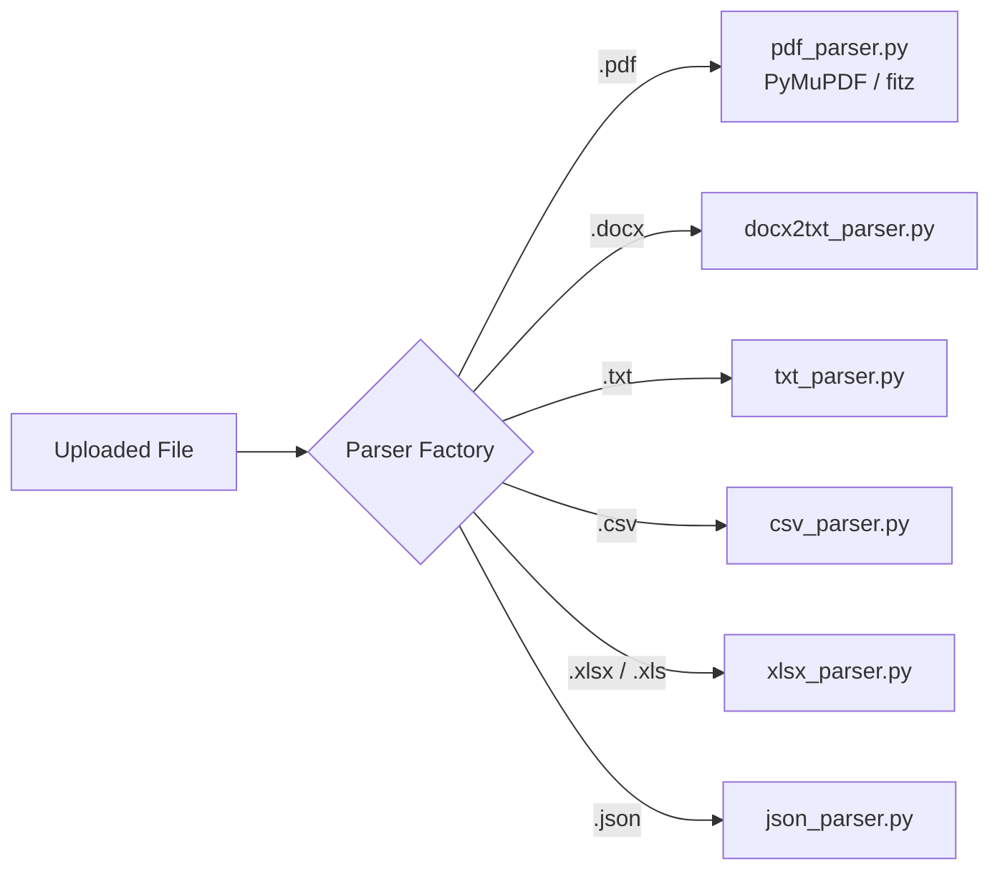

# Job Patra — Python ATS AI Agents & Scoring System Architecture Documentation

> **System Version:** 1.2  
> **Backend Service:** `JobPatra AI` (FastAPI + LangChain + LiteLLM + Pure Python Scoring Engine)  
> **Author:** Senior System Architect  
> **Last Updated:** August 2026  

---

## 1. System Overview

Job Patra’s ATS (Applicant Tracking System) backend is built as a modular, high-performance microservice in **Python 3.14**. It combines a **100% deterministic rule-based scoring engine** with an **LLM-powered AI explanation & coaching pipeline**.

### High-Level Architecture Diagram

```mermaid
flowchart TD
    subgraph Client Layer
        FE[Next.js Frontend / API Client]
    end

    subgraph Middleware & Security
        IAM[InternalAuthMiddleware\nBearer Service Token]
        RM[RequestIDMiddleware\nX-Request-ID Propagation]
        LM[LoggingMiddleware\nRequest Timing & Audit]
    end

    subgraph API Router Layer (FastAPI)
        EP_ATS[POST /v1/ats/analyze]
        EP_JD[POST /v1/ats/jd-extract]
        EP_HEALTH[GET /v1/health]
    end

    subgraph Ingestion & Normalization
        PF[Parser Factory]
        PDFP[PyMuPDF PDF Parser]
        DOCXP[Docx2txt Parser]
        TXT[Txt/CSV/Excel/JSON Parsers]
        TC[Text Cleaner & Unicode Normalizer]
        SS[Section Splitter]
    end

    subgraph Extraction & Matching Engine
        KE[Keyword Extractor]
        SE[Skill Extractor]
        EXE[Experience Extractor]
        EDE[Education Extractor]
        KM[Keyword Matcher\nExact → Synonym → Fuzzy → Semantic]
    end

    subgraph Deterministic Scoring Engine
        SE_MAIN[Scoring Engine Orchestrator]
        KWS[Keyword Sub-Scorer\n(40% Weight)]
        EXS[Experience Sub-Scorer\n(25% Weight)]
        SKS[Skills Sub-Scorer\n(15% Weight)]
        FMT[Formatting Sub-Scorer\n(10% Weight)]
        EDS[Education Sub-Scorer\n(5% Weight)]
        SUM[Summary Sub-Scorer\n(5% Weight)]
    end

    subgraph AI Explanation & Coaching Pipeline
        IG[Input Guardrails\nSize & Prompt Injection Check]
        ESC[Explain-Score LCEL Chain]
        LR[LiteLLM Router\nHealth & Failover Management]
        OG[Output Guardrails\nJSON Validation & Local Repair]
        LS[LangSmith Observability]
    end

    subgraph LLM Providers
        P_GEMINI1[Google Gemini 3.5 Flash\n(Primary)]
        P_GEMINI2[Google Gemini 3.1 Flash-Lite\n(Fallback 1)]
        P_GROQ[Groq Llama 3.1 8B Instant\n(Fallback 2)]
    end

    FE -->|HTTP Request| IAM
    IAM --> RM --> LM --> EP_ATS
    
    EP_ATS --> PF
    PF --> PDFP & DOCXP & TXT
    PDFP & DOCXP & TXT --> TC --> SS
    
    SS --> KE & SE & EXE & EDE
    KE & SE --> KM
    
    KM & EXE & EDE & SS --> SE_MAIN
    SE_MAIN --> KWS & EXS & SKS & FMT & EDS & SUM
    SE_MAIN -->|Deterministic ATSReport| ESC

    ESC --> IG
    IG -->|Validated Inputs| LR
    LR -->|LangChain Call| P_GEMINI1
    P_GEMINI1 -.->|Failover| P_GEMINI2 -.->|Failover| P_GROQ
    LR --> LS
    
    LR --> OG
    OG -->|ATSExplanation / ai_status| EP_ATS
    EP_ATS -->|ATSAnalyzeResponse JSON / SSE Stream| FE
```

### Core Components & Responsibilities

1. **API & Middleware Layer (`app/api`, `app/middleware`)**: Handles service-to-service authentication using `SecretStr` internal tokens, assigns unique trace request IDs, logs response latency, and dispatches JSON or Server-Sent Events (SSE) streaming responses.
2. **Parser Factory & Normalization (`app/analysis/parsers`, `app/analysis/normalization`)**: Ingests files (PDF, DOCX, TXT, CSV, XLSX, JSON) or raw text. Cleans control characters, strips noise, normalizes whitespace, and splits resumes into logical sections (`summary`, `experience`, `education`, `skills`, `projects`, `certifications`, `languages`).
3. **Extraction & Matching Engine (`app/analysis/extraction`, `app/analysis/matching`)**: Uses rule-based NLP, regex patterns, and gazetteers to extract entities. Matches candidate keywords against job descriptions using a strict 4-stage hierarchy: **Exact → Synonym → Fuzzy → Semantic**.
4. **Pure Python Scoring Engine (`app/analysis/scoring`)**: 100% deterministic engine. Calculates sub-scores (0–100) across 6 dimensions and applies configurable weights (`weights_config.py`). Performs zero LLM calls.
5. **AI Explanation & Coaching Pipeline (`app/ai`)**: LangChain Expression Language (LCEL) chain executing `EXPLAIN_SCORE_PROMPT_V2`. Integrates LiteLLM Router for seamless model failover, input guardrails for security, output guardrails for self-healing JSON repair, and LangSmith for telemetry.

### Technology Stack

* **Language Runtime:** Python `>=3.14`
* **Web Framework:** FastAPI `>=0.139.0`, Uvicorn (with standard ASGI extras)
* **LLM & Agent Framework:** LangChain `>=1.3.14`, LangChain-Community, LangChain-LiteLLM
* **LLM Router & Fallbacks:** LiteLLM `<1.72.0`
* **Observability & Tracing:** LangSmith `>=0.10.5`
* **PDF & Document Parsers:** PyMuPDF (`fitz`), `python-docx`, `docx2txt`, `openpyxl`, `pandas`, `unstructured`
* **Fuzzy Matching:** `rapidfuzz >=3.0.0`
* **Data Validation & Settings:** Pydantic `>=2.13.4`, `pydantic-settings >=2.14.2`
* **Testing:** Pytest `>=9.1.1`, `pytest-asyncio`, `httpx`

---

## 2. Module Structure

Below is the complete project directory structure of the `JobPatra AI` backend service (`Ai_backend`):

```
Ai_backend/
├── Dockerfile                      # Containerization file for deployment
├── pyproject.toml                  # Python dependencies & project metadata
├── uv.lock                         # UV lockfile for reproducible builds
├── main.py                         # FastAPI application entry point & middleware registration
├── config/
│   ├── .env.example                # Template for environment configuration
│   └── litellm_router.yaml         # LiteLLM routing strategy & fallback config
├── observability/
│   └── langsmith_config.py         # LangSmith tracing callback initializer
├── app/
│   ├── ai/                         # AI Agents, LCEL Chains, & Guardrails
│   │   ├── chains/
│   │   │   ├── base_chain.py       # LangSmith tracing wrapper for LCEL runnables
│   │   │   └── explain_score_chain.py # Main explain-score chain orchestrator
│   │   ├── guardrails/
│   │   │   ├── input_guardrails.py  # Deterministic input validation & injection guard
│   │   │   └── output_guardrails.py # JSON schema validator & local repair engine
│   │   ├── prompts/
│   │   │   └── explain_score_v2.py # Production prompt template (System + Human)
│   │   ├── providers/
│   │   │   └── litellm_client.py   # LiteLLM Router client & LangSmith metadata injector
│   │   └── streaming/
│   │       ├── sse_encoder.py      # Server-Sent Events (SSE) formatting
│   │       └── stream_events.py    # Pipeline event dataclasses
│   ├── analysis/                   # Pure Python Analysis & Extraction
│   │   ├── extraction/
│   │   │   ├── education_extractor.py  # Degree level & certification parser
│   │   │   ├── experience_extractor.py # Roles, duration, metrics extractor
│   │   │   ├── keyword_extractor.py    # Technical term & token extractor
│   │   │   └── skill_extractor.py      # Skill gazetteer & canonicalizer
│   │   ├── matching/
│   │   │   ├── exact_matcher.py    # Case-insensitive exact string match
│   │   │   ├── synonym_map.py      # Canonical tech synonym dictionary
│   │   │   ├── fuzzy_matcher.py    # RapidFuzz WRatio matching
│   │   │   ├── semantic_matcher.py # Cosine similarity matching (optional)
│   │   │   └── keyword_matcher.py  # 4-stage matcher orchestrator
│   │   ├── normalization/
│   │   │   ├── text_cleaner.py     # Whitespace, control char, & artifact cleaner
│   │   │   ├── jd_normalizer.py    # Job description text standardizer
│   │   │   ├── jd_preprocessor.py  # Context compressor for LLM prompt
│   │   │   └── section_splitter.py # Resume header-based section parser
│   │   ├── parsers/
│   │   │   ├── parser_factory.py   # Extension-based parser router
│   │   │   ├── pdf_parser.py       # PyMuPDF PDF text extractor
│   │   │   ├── docx_parser.py      # DOCX text extractor
│   │   │   ├── txt_parser.py       # TXT file extractor
│   │   │   ├── csv_parser.py       # CSV file extractor
│   │   │   ├── xlsx_parser.py      # Excel file extractor
│   │   │   └── json_parser.py      # JSON file extractor
│   │   └── scoring/
│   │       ├── weights_config.py   # Single source of truth for ATS weights
│   │       ├── keyword_score.py    # Keyword coverage sub-scorer
│   │       ├── experience_score.py # Duration, metrics, continuity sub-scorer
│   │       ├── skills_score.py     # Required skill coverage sub-scorer
│   │       ├── education_score.py  # Credential & degree sub-scorer
│   │       ├── summary_score.py    # Summary presence & quality sub-scorer
│   │       ├── formatting_score.py # Structure completeness sub-scorer
│   │       └── scoring_engine.py   # Main scoring orchestrator & ATSReport builder
│   ├── api/                        # FastAPI Route Controllers
│   │   └── v1/
│   │       ├── ats.py              # POST /v1/ats/analyze (JSON + SSE Stream)
│   │       ├── jd_extract.py       # POST /v1/ats/jd-extract
│   │       └── health.py           # GET /v1/health
│   ├── core/                       # App Configuration & Error Handlers
│   │   ├── config.py               # Pydantic BaseSettings singleton
│   │   ├── errors.py               # AppError hierarchy & FastAPI exception handlers
│   │   └── logging.py              # Structured logging configuration
│   ├── middleware/                 # ASGI Middleware
│   │   ├── internal_auth_middleware.py # Service token validator
│   │   ├── logging_middleware.py      # Latency & audit logger
│   │   └── request_id_middleware.py   # Trace ID generator/propagator
│   ├── schemas/                    # Pydantic V2 Contracts
│   │   ├── ai.py                   # ATSExplanation & RecommendationSchema contracts
│   │   └── ats.py                  # ATSAnalyzeRequest & ATSAnalyzeResponse contracts
│   └── services/
│       ├── ats_service.py          # End-to-end ATS pipeline orchestrator
│       └── jd_extract_service.py   # Job description extraction service
└── tests/                          # Pytest Test Suite
    ├── unit/                       # Unit tests for scoring, extraction, matching
    └── integration/                # API integration & router tests
```

---

## 3. AI Agents (LLM Integration)

The AI layer operates strictly as an **ATS Advisor and Resume Coach**. It **never modifies deterministic scores** calculated by Python; instead, it synthesizes the scoring report and candidate inputs to output actionable coaching.

### 1. Resume & Analysis Explanation Agent (`explain_score_chain.py`)

* **Input Context:**
  * Candidate Resume Text (`resume_text`)
  * Preprocessed Job Description Context (`jd_context`)
  * Deterministic Sub-scores (`overall_score`, `keyword_score`, `experience_score`, `skills_score`, `education_score`, `summary_score`, `formatting_score`)
  * Lists of matched/missing keywords & canonical skills
  * Extracted work experience & education metrics
* **Output Schema (`ATSExplanation` in `app/schemas/ai.py`):**

```python
class ATSExplanation(BaseModel):
    strengths: list[str]                  # 2–4 concrete bullet strengths
    weaknesses: list[str]                 # 2–4 concrete bullet weaknesses
    section_explanations: list[SectionExplanation] # Breakdown per dimension
    suggestions: list[str]                # 3–6 high-level action items
    summary: str                          # 1-paragraph executive fit summary
    recommendations: list[RecommendationSchema] # High-impact copy-paste suggestions
```

* **Prompt Engineering (`EXPLAIN_SCORE_PROMPT_V2`):**
  * Configured with a system role: *"You are a world-class Senior Resume Writer and expert recruiter with experience hiring software engineers and tech professionals..."*
  * **Strict Policy:** Every recommendation must provide **complete, copy-paste ready content** (e.g., full rewritten bullet points or category-grouped skills). Generic advice ("add metrics") is forbidden.
* **LLM Provider & Router Architecture (`litellm_client.py`):**
  * Backed by `LiteLLM Router` with automatic health checks, cooldowns, and retries.
  * **Primary Model:** `gemini/gemini-3.5-flash`
  * **Fallback Model 1:** `gemini/gemini-3.1-flash-lite`
  * **Fallback Model 2:** `groq/llama-3.1-8b-instant`

### 2. Job Description Extraction Service (`jd_extract_service.py`)

* Processes raw JD text using `jd_normalizer` and `keyword_extractor`.
* Extracts required technical skills, preferred skills, domain concepts, and experience expectations into a structured dictionary.

### 3. Recommendation & Copy-Paste Engine (`RecommendationSchema`)

Every generated recommendation follows a rigid structural contract:

```python
class RecommendationSchema(BaseModel):
    priority: Literal["High", "Medium", "Low"] # Impact ranking
    issue: str                                # Exact problem description
    why: str                                  # Why ATS/recruiter penalizes this
    copy_paste_content: str                   # 100% complete replacement text
    placement: str                            # Precise location instruction
    ats_impact: str                           # Estimated gain (e.g., "+15 points")
```

---

## 4. Scoring Engine (Pure Python)

The scoring engine lives entirely inside `app/analysis/scoring/`. It is **100% deterministic, side-effect free, and performs zero I/O or LLM calls**.

### Scoring Metrics & Sub-Scorers

#### 1. Keyword Score (`keyword_score.py`)
Calculates JD keyword coverage across the candidate resume:
$$\text{Keyword Score} = \left( \frac{\text{Count}(\text{Matched Keywords})}{\text{Count}(\text{Matched Keywords}) + \text{Count}(\text{Missing Keywords})} \right) \times 100$$
*Returns `0.0` if the Job Description contains no extractable keywords.*

#### 2. Skills Coverage Score (`skills_score.py`)
Evaluates coverage of canonical technical skills specified in the JD:
$$\text{Skills Score} = \left( \frac{\text{Count}(\text{Matched Skills})}{\text{Count}(\text{Required Skills})} \right) \times 100$$

#### 3. Experience Score (`experience_score.py`)
Evaluates work history quality across 4 weighted sub-signals (max 100 pts total):
* **Duration Score (Max 40 pts):** Based on total years of work experience (capped at 10.0 years for full points).
* **Continuity Score (Max 20 pts):** Number of distinct positions held (capped at 4 jobs for full points).
* **Bullet Density (Max 20 pts):** Description depth (capped at average of 4 bullets/job).
* **Metrics Score (Max 20 pts):** Presence of quantified metrics (%, $, x multipliers, capped at 6 metrics).

#### 4. Formatting Score (`formatting_score.py`)
Evaluates structural completeness based on detected section headers:

| Section Header | Allocated Points |
| :--- | :--- |
| **Experience** | 30 pts |
| **Education** | 20 pts |
| **Skills** | 20 pts |
| **Summary / Objective** | 15 pts |
| **Projects** | 5 pts |
| **Certifications** | 5 pts |
| **Languages** | 5 pts |
| **Total Possible** | **100 pts** |

#### 5. Education Score (`education_score.py`)
Awards base points according to the highest degree level detected:
* **PhD / Doctorate:** 100 pts
* **Master / M.Sc / M.Tech / MBA:** 90 pts
* **Bachelor / B.Sc / B.Tech / BE:** 80 pts
* **Associate / Diploma:** 60 pts
* **Other Recognized Credential:** 50 pts
* **No Degree Detected:** 0 pts  
*Bonus:* `+5 pts` per certification (capped at `+10 pts` total bonus). Score clamped to `[0, 100]`.

#### 6. Summary Quality Score (`summary_score.py`)
* Summary present & non-empty: `+40 pts`
* Word count $\ge 20$ words: `+20 pts`
* Word count $\ge 50$ words: `+20 pts` (cumulative)
* Contains action verbs (*built, scaled, optimized*): `+10 pts`
* Contains quantified metrics: `+10 pts`

### Weights Configuration (`weights_config.py`)

The overall score is computed via a weighted sum defined in `ScoringWeights`.

```python
DEFAULT_WEIGHTS = ScoringWeights(
    keyword_score=0.40,     # 40% Weight (Highest signal)
    experience_score=0.25,  # 25% Weight
    skills_score=0.15,      # 15% Weight
    formatting_score=0.10,  # 10% Weight
    education_score=0.05,   #  5% Weight
    summary_score=0.05,     #  5% Weight
)
```
*Invariant:* A startup assertion (`assert abs(total - 1.0) < 1e-9`) enforces that weights sum to exactly 1.0.

$$\text{Overall Score} = \sum (\text{Sub-score}_i \times \text{Weight}_i)$$

### 4-Stage Keyword Matching Engine (`keyword_matcher.py`)

Keywords pass through a strict 4-stage matching hierarchy:
1. **Exact Match (`exact_matcher.py`):** Case-insensitive, whitespace-normalized equality.
2. **Synonym Match (`synonym_map.py`):** Lookups against canonical technical dictionary (e.g., "React.js" $\leftrightarrow$ "ReactJS" $\leftrightarrow$ "React").
3. **Fuzzy Match (`fuzzy_matcher.py`):** RapidFuzz `WRatio` token matching against configurable threshold (default `85`).
4. **Semantic Match (`semantic_matcher.py`):** Vector cosine similarity pass (used when embedding provider is enabled).

---

## 5. Data Models (Pydantic V2 & Dataclasses)

### Request Schemas (`app/schemas/ats.py`)

```python
class ResumeInput(BaseModel):
    filename: str | None = None
    file_bytes: bytes | None = None  # Auto-decodes Base64 or accepts raw bytes
    text: str | None = None          # Raw text mode

class JobDescriptionInput(BaseModel):
    text: str

class ATSAnalyzeRequest(BaseModel):
    resume: ResumeInput
    job_description: JobDescriptionInput
    stream: bool = False             # Set True for SSE streaming
```

### Response Schema (`app/schemas/ats.py`)

```python
class ATSAnalyzeResponse(BaseModel):
    overall_score: float
    keyword_score: float
    experience_score: float
    skills_score: float
    education_score: float
    summary_score: float
    formatting_score: float
    
    matched_keywords: list[MatchedKeywordSchema]
    missing_keywords: list[str]
    matched_skills: list[str]
    missing_skills: list[str]
    
    experience_summary: ExperienceSummarySchema
    education_summary: EducationSummarySchema
    
    processing_time_ms: float
    version: str = "1.2"
    
    ai_status: Literal["ok", "unavailable"]
    ai_explanation: ATSExplanation | None = None
```

### Internal Scoring Dataclass (`app/analysis/scoring/scoring_engine.py`)

```python
@dataclass
class ATSReport:
    keyword_score: float
    experience_score: float
    skills_score: float
    formatting_score: float
    education_score: float
    summary_score: float
    overall_score: float
```

---

## 6. API Endpoints (FastAPI)

### Primary Endpoint: `POST /v1/ats/analyze`

* **Authentication:** Required header `Authorization: Bearer <INTERNAL_SERVICE_TOKEN>`
* **Request Format:** `application/json`

#### Sample JSON Request Body:
```json
{
  "resume": {
    "filename": "john_doe_resume.pdf",
    "file_bytes": "JVBERi0xLj... (Base64 encoded string)"
  },
  "job_description": {
    "text": "We are seeking a Senior Full Stack Engineer proficient in React, Node.js, and PostgreSQL..."
  },
  "stream": false
}
```

#### Sample JSON Response (`200 OK`):
```json
{
  "overall_score": 82.45,
  "keyword_score": 75.0,
  "experience_score": 88.0,
  "skills_score": 90.0,
  "education_score": 80.0,
  "summary_score": 70.0,
  "formatting_score": 100.0,
  "matched_keywords": [
    { "keyword": "React", "matchType": "EXACT", "similarity": null },
    { "keyword": "NodeJS", "matchType": "SYNONYM", "similarity": null }
  ],
  "missing_keywords": ["Kubernetes", "GraphQL"],
  "matched_skills": ["React", "Node.js", "PostgreSQL"],
  "missing_skills": ["Kubernetes"],
  "experience_summary": {
    "total_entries": 3,
    "total_years": 5.5,
    "has_metrics": true
  },
  "education_summary": {
    "highest_degree": "B.Tech",
    "certifications": ["AWS Certified Solutions Architect"]
  },
  "processing_time_ms": 342.1,
  "version": "1.2",
  "ai_status": "ok",
  "ai_explanation": {
    "strengths": [
      "Strong alignment in core frontend technologies (React, TypeScript).",
      "Demonstrated experience with database optimization and REST APIs."
    ],
    "weaknesses": [
      "Missing container orchestration experience (Kubernetes) required by the JD."
    ],
    "section_explanations": [
      {
        "section": "Keywords",
        "score": 75.0,
        "explanation": "Matched 15 out of 20 core keywords from the job description."
      }
    ],
    "suggestions": [
      "Add a dedicated Cloud & DevOps subsection under skills to highlight Docker/Kubernetes."
    ],
    "summary": "John is a strong candidate for this role with an overall score of 82.45/100...",
    "recommendations": [
      {
        "priority": "High",
        "issue": "Missing Kubernetes keyword in work experience",
        "why": "The target role heavily emphasizes cloud infrastructure.",
        "copy_paste_content": "• Containerized microservices using Docker and orchestrated deployments using Kubernetes.",
        "placement": "Add under Software Engineer role at Acme Corp.",
        "ats_impact": "+10 points on keyword match score"
      }
    ]
  }
}
```

---

## 7. PDF & Document Parsing Utilities

Document ingestion is handled by `app/analysis/parsers/parser_factory.py`.



### PDF Extraction Pipeline (`pdf_parser.py`)

1. **Thread-Safe Storage:** Writes raw PDF bytes to a unique temporary workspace file (`.temp_pdf_parser/resume_<uuid>.pdf`).
2. **SHA-256 Verification:** Logs file size, SHA-256 hash, and initial/tail magic bytes to detect corrupt uploads.
3. **PyMuPDF Extraction:** Loads file using LangChain's `DirectoryLoader` with `PyMuPDFLoader`.
4. **Scanned PDF Check:** If no text layer is extracted, raises `UnparsableDocumentError` (HTTP 422).
5. **Automatic Cleanup:** Safely unlinks temporary files in a `finally:` block.

---

## 8. Environment Variables & Configuration

Application settings are loaded via `pydantic-settings` from `config/.env`.

```ini
# Application Base Settings
APP_NAME="JobPatra AI"
ENV="development"
HOST="0.0.0.0"
PORT=8000
LOG_LEVEL="INFO"
DEBUG_ATS_PIPELINE=false

# Service Authentication (REQUIRED - Application fails on startup if missing)
INTERNAL_API_KEY="sk_live_internal_secret_key"
INTERNAL_SERVICE_TOKEN="token_live_service_bearer"

# LiteLLM & Model Provider Keys
GOOGLE_API_KEY="AIzaSy..."
GROQ_API_KEY="gsk_..."

# Sampling Overrides
LLM_TEMPERATURE=0.2
LLM_MAX_TOKENS=1024

# LiteLLM Router Settings
LITELLM_ROUTER_CONFIG_PATH="config/litellm_router.yaml"
LITELLM_ROUTING_STRATEGY="simple-shuffle"
LITELLM_TIMEOUT=10.0
LITELLM_RETRY_COUNT=2
LITELLM_COOLDOWN_TIME=30
LITELLM_MAX_FAILURES=3

# Observability (LangSmith)
LANGSMITH_TRACING_ENABLED=false
LANGSMITH_API_KEY="lsv2_pt_..."
LANGSMITH_PROJECT="jobpatra-ai"
```

---

## 9. Error Handling & Resilience

### Custom Exception Hierarchy (`app/core/errors.py`)

```
AppError (Base Exception)
├── ValidationError          (400 Bad Request)
├── UnauthorizedError       (401 Unauthorized)
├── NotFoundError           (404 Not Found)
├── UnparsableDocumentError (422 Unprocessable Entity - Invalid PDF/DOCX)
├── InvalidInputError       (422 Unprocessable Entity - Prompt Injection / Oversized Text)
└── InternalServerError     (500 Internal Error)
```

### Non-Blocking AI Failure Handling (`AIGenerationError`)

`AIGenerationError` is intentionally **not** an `AppError`. If the LLM provider fails (timeout, rate limit, or invalid JSON output):
1. `ats_service.analyze()` catches `AIGenerationError` or generic LLM exceptions.
2. The response `ai_status` is updated to `"unavailable"`.
3. `ai_explanation` is set to `None`.
4. **HTTP 200 OK is returned** with the complete deterministic report intact.

---

## 10. Deployment & Scaling Considerations

### Docker Containerization (`Dockerfile`)

```dockerfile
FROM python:3.14-slim AS base

WORKDIR /app

RUN apt-get update && apt-get install -y --no-install-recommends \
    build-essential curl && \
    rm -rf /var/lib/apt/lists/*

COPY pyproject.toml uv.lock ./
RUN pip install --no-cache-dir uv && uv pip install --system .

COPY . .

EXPOSE 8000
CMD ["uvicorn", "main.py:app", "--host", "0.0.0.0", "--port", "8000"]
```

### Rate Limiting & Health Cooldowns

* **LiteLLM Router** monitors RPM (Requests Per Minute) limits per deployment (e.g., 15 RPM for Gemini 3.5 Flash, 30 RPM for Groq).
* If a model fails 3 consecutive times, it is cooled down for 30 seconds while traffic is seamlessly routed to secondary fallbacks.

---

## 11. Testing Strategy

The backend includes a comprehensive `pytest` test suite with 35+ test files covering unit, integration, and mock scenarios.

```bash
# Run unit tests for scoring engine and matchers
pytest tests/unit/test_scoring_engine.py tests/unit/test_keyword_matcher.py

# Run test suite with coverage
pytest --cov=app tests/

# Test AI Chain & LiteLLM router mock failover
pytest tests/unit/test_explain_score_chain.py tests/unit/test_litellm_router.py
```

### Key Test Coverage Highlights

* `test_scoring_engine.py`: Verifies deterministic mathematical score computation across all weights.
* `test_keyword_matcher.py`: Validates 4-pass matching logic (Exact $\rightarrow$ Synonym $\rightarrow$ Fuzzy $\rightarrow$ Semantic).
* `test_input_guardrails.py`: Tests prompt injection mitigation and string length constraints.
* `test_output_guardrails.py`: Tests JSON auto-repair logic when LLMs return truncated markdown codeblocks.

---
*End of Documentation — Job Patra AI Engineering Team*
